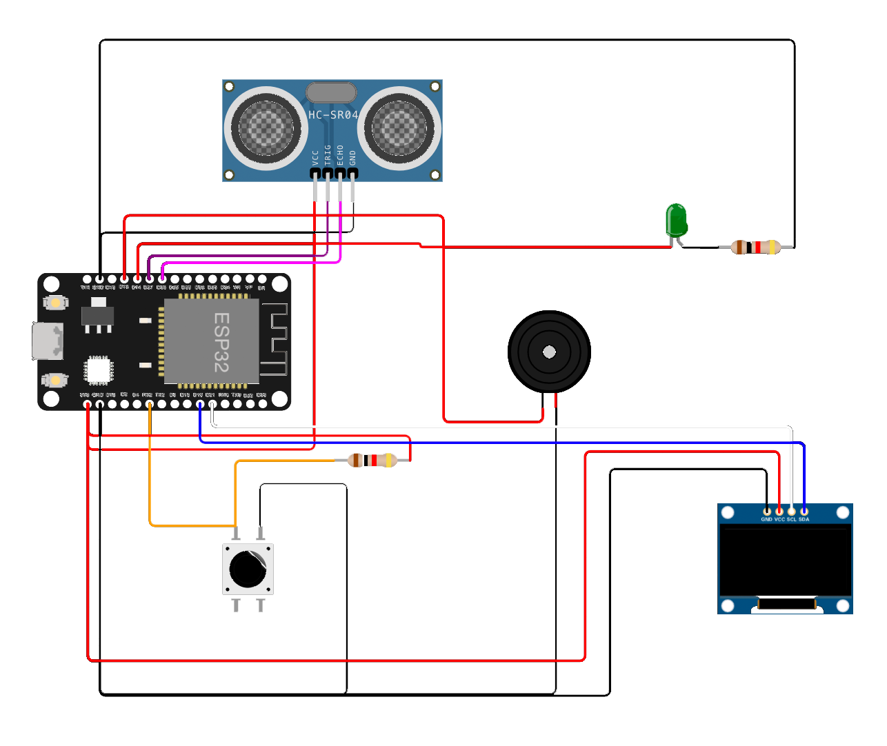

# 💧 Arduino Water Tank Level Monitoring using Blynk 📱

This is a simple yet effective Arduino project that monitors the water level in a tank 🌊 using an ultrasonic sensor and sends the data to a Blynk app via WiFi 📶. The Blynk app allows you to view the water level in real-time 📊 and receive alerts 🚨 when the tank is running low on water.

## 🛠️ Components Used

- Arduino Uno
- HC-SR04 Ultrasonic Sensor
- Jumper Wires
- Breadboard
- Blynk App (Available on [App Store](https://apps.apple.com/) and [Play Store](https://play.google.com/store))

## 🔌 Wiring Diagram

Connect the components as shown in the wiring diagram below:

## 📚 Installing Libraries

To use this project, you will need to install the Blynk and NewPing libraries. Follow these steps to install the libraries:

1. Open the Arduino IDE.
2. Go to Sketch > Include Library > Manage Libraries.
3. Search for "Blynk" and click on "Blynk by Volodymyr Shymanskyy". Click on "Install".
4. Search for "NewPing" and click on "NewPing by Tim Eckel". Click on "Install".

## 📲 Setting Up Blynk App

1. Download and install the Blynk app from the App Store or Play Store.
2. Create a new account or log in if you already have an account.
3. Create a new project and select "Arduino Uno" as the hardware model.
4. Add a Gauge widget to the project and configure it to display the water level data from the Arduino.

## ⬆️ Uploading the Code

1. Open the Arduino IDE.
2. Copy and paste the code from the `code/arduino.ino` file in this repository.
3. Replace the `auth` variable with your Blynk authentication token.
4. Select the correct board and port from the Tools menu.
5. Upload the code to the Arduino.

## 📈 Usage

1. Connect the Arduino to power and to the WiFi network.
2. Open the Blynk app and select the project you created.
3. The water level should be displayed on the Gauge widget in real-time.
4. You can receive alerts when the water level falls below a certain level by adding a Notification widget to the project and configuring it to send a push notification when the water level is low.

## 👥 Contributing

If you find any issues or have suggestions for improvements, feel free to create a pull request or submit an issue on this repository.

## 📄 License

This project is licensed under the MIT License. See the LICENSE file for details.
